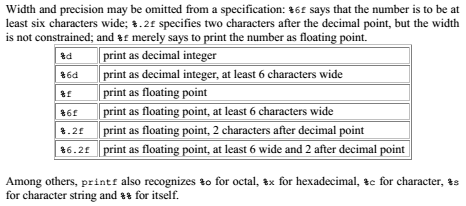

## Notes
- when you apply an 'arithmetic' operator to a floating point and int then the int is converted to a floating point before the operation goes through

### Printf
Some arguments from printf

